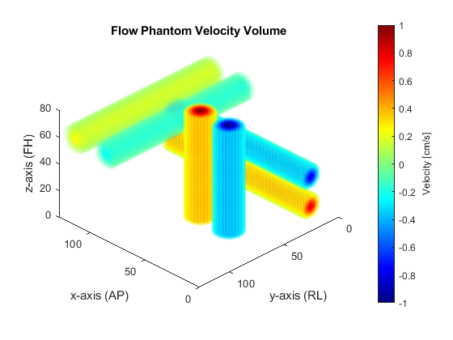

# synthflow_phantom

synthetic flow phantom for simulating constant velocity water in pipes and acquisition of multi-planar phase contrast MRI scans

## Publications

__Fetal whole-heart 4D flow cine MRI using multiple non-coplanar balanced SSFP stacks__  
Thomas A. Roberts, Joshua F. P. van Amerom, Alena Uus, David F. A. Lloyd, Milou P. M. van Poppel, Anthony N. Price, Jacques-Donald Tournier, Chloe A. Mohanadass, Laurence H. Jackson, Shaihan J. Malik, Kuberan Pushparajah, Mary A. Rutherford, Reza Razavi, Maria Deprez & Joseph V. Hajnal 

__Nature Communications__. 2020. doi: [https://doi.org/10.1038/s41467-020-18790-1](https://doi.org/10.1038/s41467-020-18790-1)

__bioRxiv__. 2019. doi: [https://doi.org/10.1101/635797](https://doi.org/10.1101/635797) (_pre-print_)  

## Directories

__synth_flow__ - scripts for constructing phantom and simulating scanner

__matlab-common__ - submodule containing useful MATLAB scripts 

## Installation

Add everything to MATLAB path. Run `synthflow_phantom.m`. Edit if desired.

## External Dependencies

None, but rview is recommended for viewing the output .nii files in a world coordinate system. MITK Workbench is also good, but prone to load errors associated with .nii files in certain orientations.

## Overview 

For volumetric fetal MRI, multiple stacks of single-slice data are acquired and combined to make a 3- or 4-dimensional reconstructed volume using slice-to-volume registration (SVR) techniques. For fetal blood flow imaging of the heart and major vessels, we adopt a similar approach. The acquired stacks can be orientated at any angle in space, therefore, the velocity-encoding directions associated with the stacks are non-colinear, i.e: they are not conveniently aligned along orthogonal x-/y-/z- axes, as is often the case in conventional MR velocity imaging.

The purpose of this synthetic flow phantom is to simulate acquiring stacks of phase contrast MR images in any orientation, which can then be recombined to form a 3D vector representation of flow velocity. By default, the flow phantom consists of six orthogonal pipes with a range of flow rates:

The user can then 'image' the phantom in any orientation using a configurable stack of slices:

## Steps

__Setup__

1. Add folder and subfolders to MATLAB path.
2. Open `synthflow_phantom.m` and run.
	- This is a wrapper script so that parameters can be edited without changing the main files.
	- Default settings can be used, or user can edit.
	- By default, output files are saved to the current directory. This can be changed using the `saveDataDir` variable.
3. Output files include:
	- flow_phantom_vel_volume.nii.gz: nifti of the flow phantom volume in the 'scanner'
	- stack_*.nii.gz: stack of phase slices
	- stack*_grad_moment*.txt files: information on specified gradient first moments sizes. For the paper, these are supplied to the SVR reconstruction pipeline. Note: we use a 1.5T Philips Achieva, so these values might not be consistent between scanners.

Any questions, feel free to email me.
